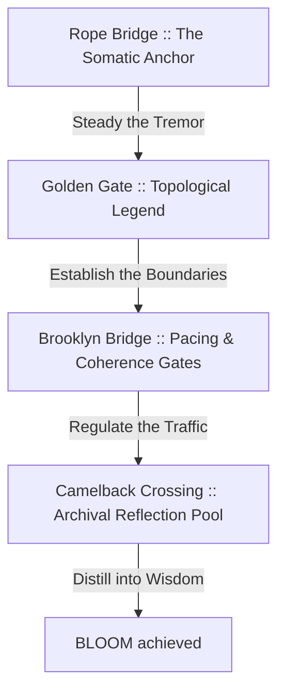

# THE CLARITY BRIDGE LENS :: CONSCIOUS SYSTEM REVIEWER

This document defines the **Clarity Bridge Lens** :: a cognitive design framework to evaluate human experiences at **The Alien School for Creative Thinking**. This lens reviews interfaces, codebases, and systems, ensuring that raw human attention is gently and structurally guided from initial challenge toward creative wisdom.

Use this document to align current and future applications with the somatic maturation journey of the scholar.

---

## :: THE FOUR BRIDGE PHASES

Systems must match the emotional, structural, and somatic capacity of the scholar at each stage of their developmental semester (spanning 4–6 months).

### 1. The Rope Bridge :: The Somatic Anchor (Face 01 — Seed)
*   **The Sensation** :: High somatic load, chaos, vulnerability, uncertainty. The scholar feels like they are stepping onto a rickety rope bridge with a perilous drop beneath.
*   **The System Invitation** :: Establish immediate grounding. Provide breathing loops, posture alignment cues, and clear naming boundaries before complex operations begin.

### 2. The Golden Gate :: The Topological Legend (Faces 02–05 — Structuring)
*   **The Sensation** :: High-altitude perspective, structure, mapping, initial clarity. The scholar can see the expanse of their consciousness, but needs handrails to navigate.
*   **The System Invitation** :: Map the territory explicitly. Equip geometries with legends, hover descriptors, and structural divisions. Transform abstract math into clear, relatable paths.

### 3. The Brooklyn Bridge :: Pacing & Coherence Gates (Faces 06–10 — Integration)
*   **The Sensation** :: High thought traffic, rush hour, active processing, rapid typing. The scholar is crossing with ease, yet is vulnerable to cognitive acceleration.
*   **The System Invitation** :: Pace the attention. Monitor typing speeds, input velocities, and state changes. Restrict progression when speed exceeds somatic integration capacity. Invite the conscious pause.

### 4. The Camelback Crossing :: The Archival Reflection Pool (Faces 11–12 — Wisdom)
*   **The Sensation** :: Stillness, reflection, peace, architectural unity. The scholar reaches a sturdy, local stone crossing with mountain views and quiet waters.
*   **The System Invitation** :: Solidify the archive. Allow the scholar to download journals, review named stone historical changes, and trace their progress across the entire field.

---

## :: THE CONSCIOUS REVIEW CHECKS

Review every module, file, and interaction against these five core alignments:

1.  **Somatic Grounding** :: Does the entry point invite a pause or check posture?
2.  **Topological Clarity** :: Is the interface structure mapped and explained via hover states or visible legends?
3.  **Pacing Regulation** :: Are there gates that prevent scholars from rushing through writing or navigation?
4.  **Reflective Integration** :: Does the climax offer an archival download or visual summary of the journey?
5.  **Language Resonance (The Listener's Path)** :: Is the copy entirely affirmative, omitting negations (such as *not, don't, can't, won't, isn't, never, but*)?
